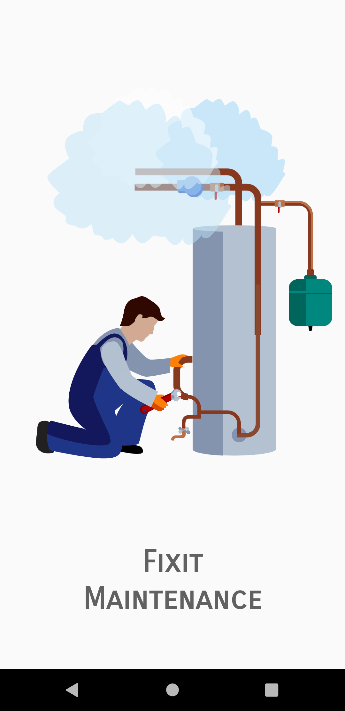
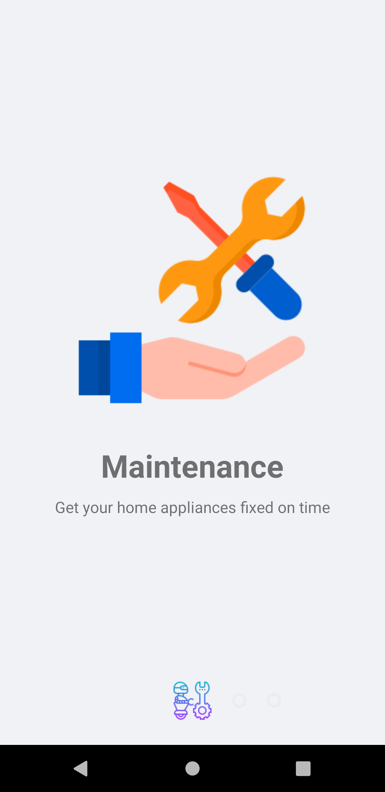
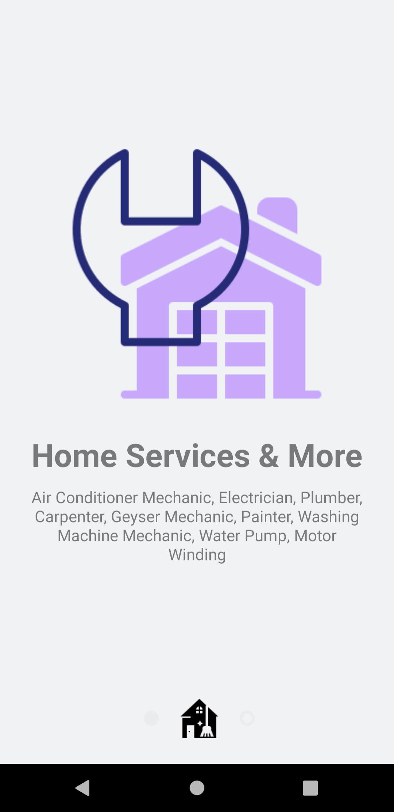
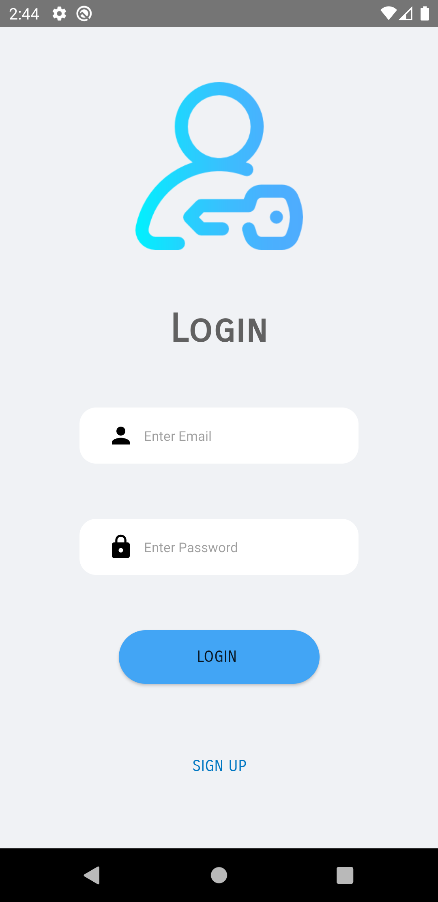
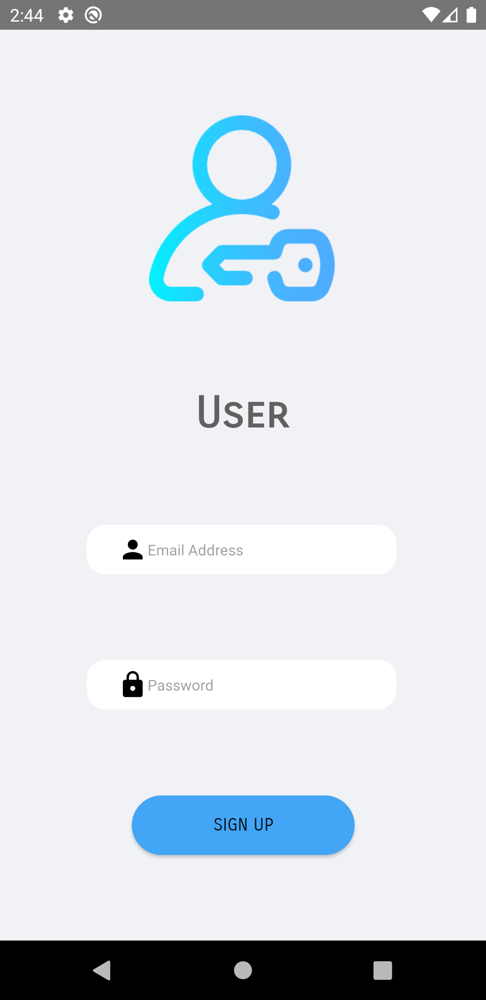
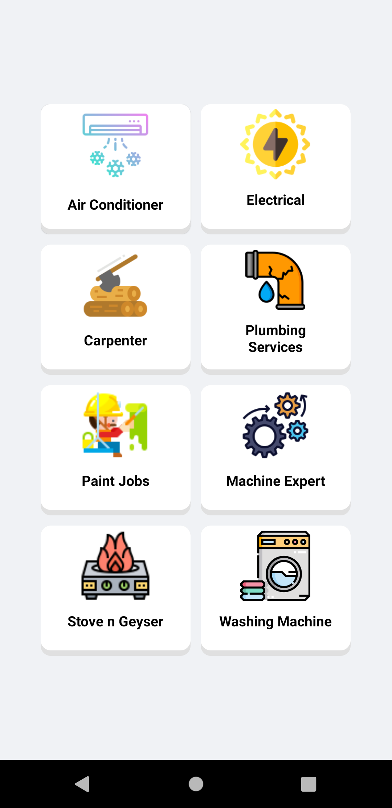
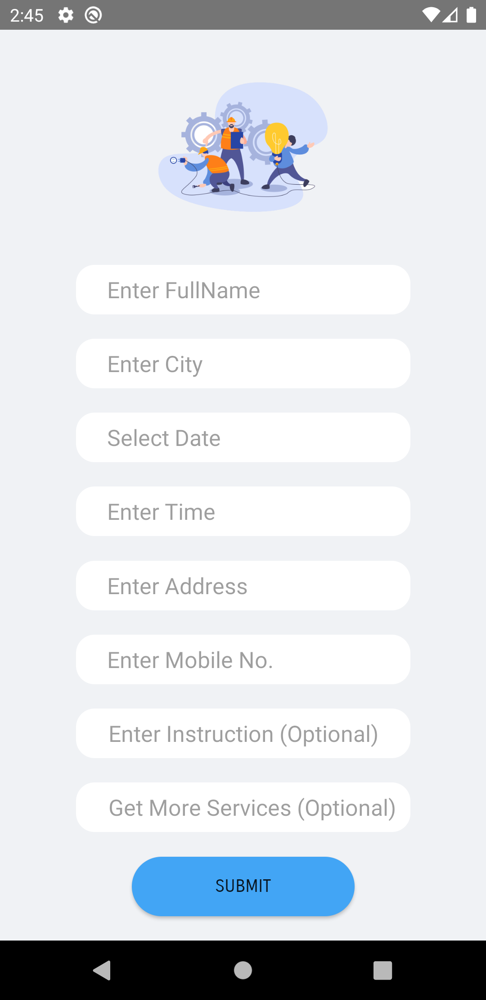
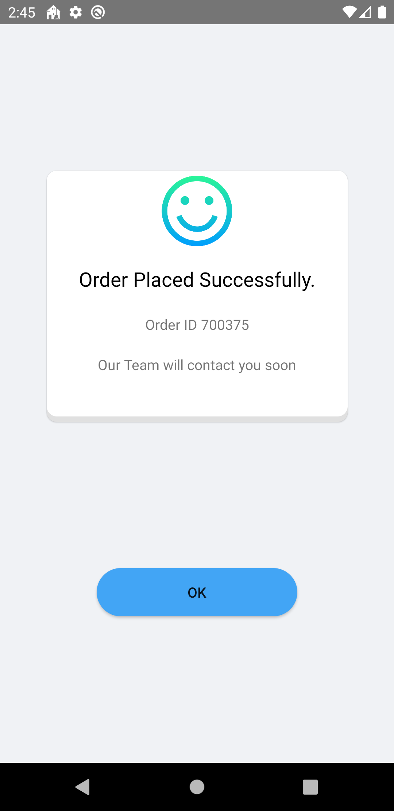
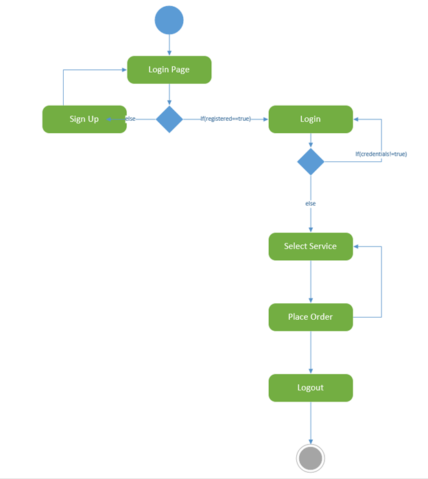

<html>
<body>
<h1>Fixit Maintenance App</h1>  

An Maintenance Services app which let users to place order to different services like paint, electrical services, plumbing etc. 
This is Simple maintenance service system build in java and Firebase, this application provides all the features like place order, specific date & time and Push Notification.

 
<h1>Goal</h1>

To build a Maintenance app for which user can place order for different maintenance services like paint, electrical services etc. at his/her desired date & time.

<h3>Animations used in app</h3>
  <h4><ul>
  <li>Lottie Animation</li>
  <li>Paper onBoarding</li>
  <li>Push Notification</li>
</ul></h4>

<h1>Application UI</h1>

<h1>Activity Diagram</h1>

</body>
</html>
